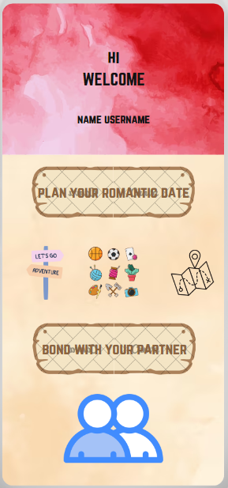
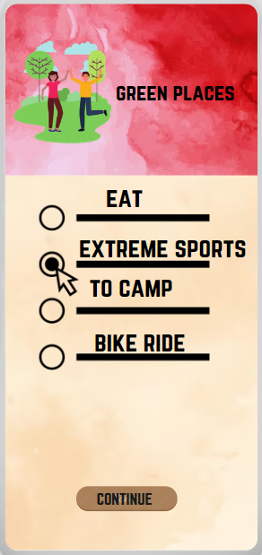

# Diseño interfaz de usuario
El diseño de interfaz de usuario - DateVenture fue creado desde cero siguiendo algunos patrones parecidos
a los de una aplicacion de planificación de citas.

Logo DateVenture :

## Principales  
Permite a las parejas crear perfiles individuales y vincularse como pareja en la aplicación. Esto ayudará a personalizar las recomendaciones según los intereses y presupuestos compartidos.
### 1. Inicio
El usuario introduce los datos necesarios al utilizar la aplicación por primera vez, así como también visualiza la interfaz una vez que esté registrado en la misma.

## 2. Perfil inicio
El usuario puede ver el inicio de su aplicacion, donde podra planificar sus citas. Hay opcion de sincronizacion con tu pareja o inmediatamente crear tu primera aventura!

## 3. Vinculación con tú pareja
El usuario podrá vincularse por medio del nombre o apodo de usuario de la pareja. 

## 4. Filtro de preguntas acerca de ti y tus gustos

El usuario empieza a crear su cita soñada, empezando con sus preferencia de lugares, como verán a continuación:

## 5. Ingresamos a las categorías propuesta

### 5.1 Categoría restaurants
El usuario podrá elegir diferentes tipos de comida segun su preferencia.

### 5.2 Categoría Travel 
El usuario podrá seleccionar paises de su preferencia o solo Colombia.

### 5.3 Categoría home 
El usuario podrá seleccionar que prefiere hacer cuando esta en casa.

### 5.4 Categoría Green Spaces
El usuario podrá selecciona lugares que llamen su atención al aire libre.

##
